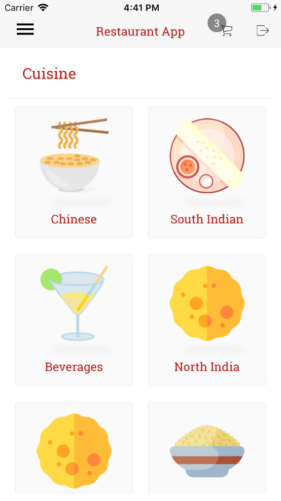
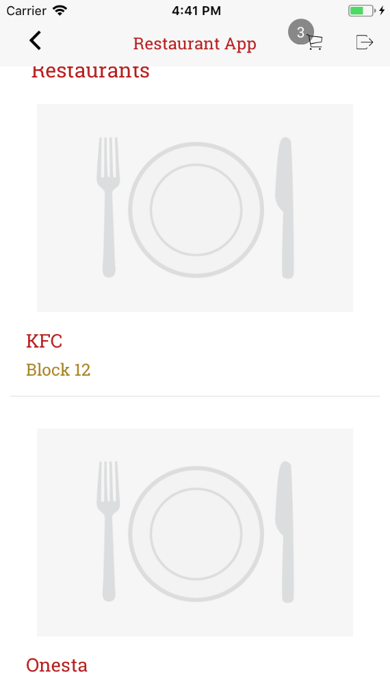
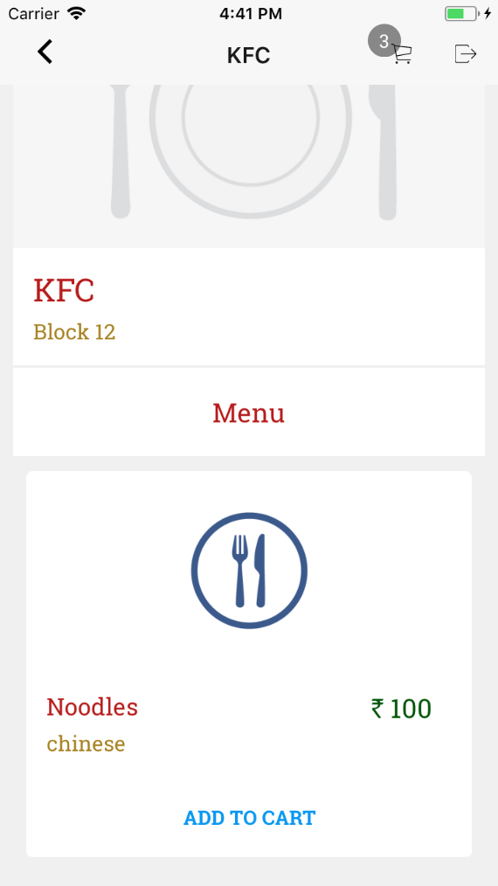
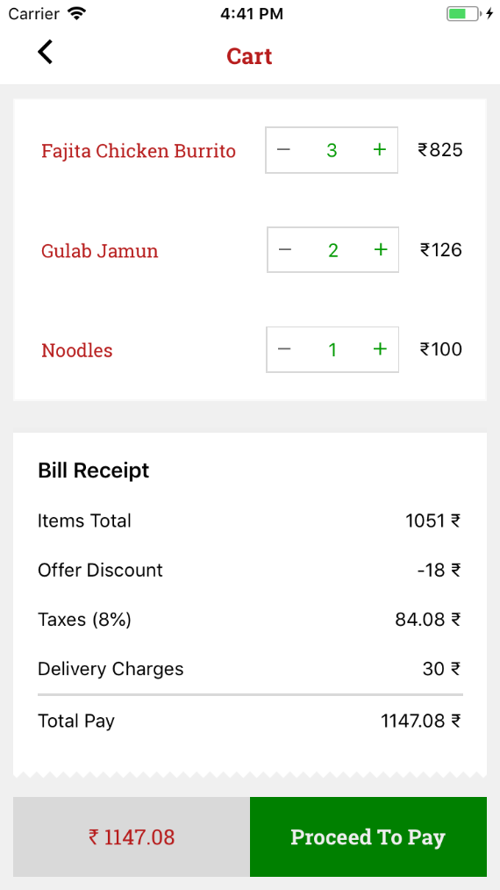
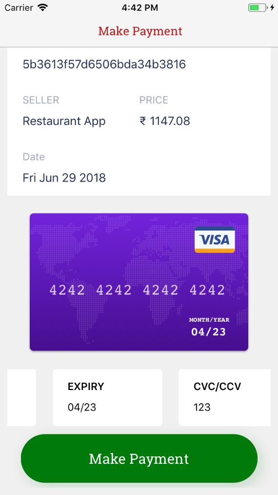

# Restaurant App

BoilerPlate Used React Native [https://github.com/kaushiknishchay/React-Native-Boilerplate](https://github.com/kaushiknishchay/React-Native-Boilerplate)
BoilerPlate Used React.JS [https://github.com/Codebrahma/Codebrahma-React-Boilerplate](https://github.com/Codebrahma/Codebrahma-React-Boilerplate)

## Setup

## Prerequisites

- Install and  setup the backend server
 
[https://github.com/Codebrahma/RestaurantApp-Express](https://github.com/Codebrahma/RestaurantApp-Express)

### Installation

- run `npm install` or `yarn install`

### Run on Device

- run `yarn android` or `yarn ios` to run on device or emulator

### Start the web version

- run `yarn start:web`

### Project info


Main objective of this project was to have a single code base for both 
web and mobile apps with the logic and view separated.

#### Project Structure

```
    /android                - React native android source code
    
    /app                    - React native specific code
        /base_components    - reusable react native components
        /components         - react native components
        /screens            - connected to store components
        /App.js             - App Root component
        /router.js          - route config
        
    /assets                 - contains image and fonts
    /ios                    - React native ios source code
    
    /src
        /actions            - all redux actions
        /constants          - colors and Assets
        /reducers           - all reducers
        /sagas              - all redux sagas
        /screen             - connected components which access the store (containers from react perspective)  
        /service            - API methods
        /store              - store config
        /utils              - some utility functions

    /web                    - react js web specific code
    /webpack                - webpack config
    
```


#### ScreenShots - Native App









